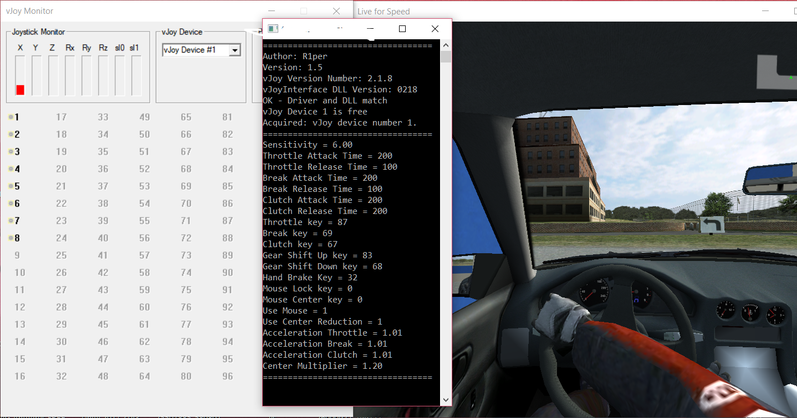

# 20.03.2020 New version of program avaliable on https://r1per.itch.io/mtvj
# MouseToVJoy
> Application that converts mouse/keyboard input to vjoy output.

Simple application that converts mouse/keyboard input to vjoy output, created using vjoyinferace and winapi32.

## Download

Releases tap on Github or https://github.com/R1PeR/MouseToVJoy/releases
You need all three files

## Installation

Windows:

Open MouseToVJoy.exe

Enjoy.

## Usage example

Useful for racing games, created especially for Assetto Corsa to remove traction control that was build into gamee.
Some games I tested it with: Assetto Corsa, Live For Speed, Rfactor.

## Release History
* 1.7
    * ADD: Support for 'ForceFeedback' on Assetto Corsa.
    * ADD: `Use Wheel as Shifter`.
* 1.68
    * FIX: `ForceFeedback` not working.
* 1.67
    * FIX: Issue with center reduction not working.
* 1.66
    * FIX: Issue with self moving steering wheel.
* 1.65
    * FIX: `ForceFeedback` not working.
* 1.64
    * ADD: Command line support, '-noconsole' to launch without console.
    * FIX: Code structure, made it more pleasant to read.
* 1.63
    * ADD: `Force Feedback` Working for Periodic Force.
* 1.62
    * ADD: Ability to use mouse buttons on other functions than breake and throttle.
* 1.61
    * FIX: `UseMouse` Not Working (Thanks nonical)
* 1.6
    * ADD: `Force Feedback` Working only for Constant Force
* 1.5
    * ADD: 3 Configurable buttons.
* 1.41
    * FIX: `Sensitivity Center Reduction` not working. 
* 1.4
    * ADD: `Sensitivity Center Reduction`.
* 1.3
    * ADD:  `Center Mouse Steering Axis`.
* 1.21
    * FIX: Typo in Breaking logic.
* 1.2
    * ADD: Acceleration options.
* 1.1
    * ADD: Configurable buttons.
* 1.0
    * First working release.

### Prerequisites

Requires installed version of VJoy 2.1.8. Available here: 
https://sourceforge.net/projects/vjoystick/files/Beta%202.x/

## Configuration

Program can be configured through config.txt file, which have 21 different values, that can be modified through any text editor.
For easier tweaking use VjoyMonitor to visualize axis changes.

### Sensitivity

The main sensitivity multiplier.
Raw data from mouse is multiplied by this value and then added to Vjoy Axis. 

E.g. Sensitivity = 6.0

### AttackTimeThrottle

Throttle value when pressed.
When throttle is pressed, every 2 ms value is added to Vjoy Axis. 
The greater the steaper slope of attack.

E.g. AttackTimeThrottle = 200

### ReleaseTimeThrottle

Throttle value when released.
When throttle is released, every 2 ms value is subtracted from Vjoy Axis. 
The greater the steaper slope of release.

E.g. ReleaseTimeThrottle = 100

### AttackTimeBreak

Break value when pressed.
When break is pressed, every 2 ms value is added to Vjoy Axis. 
The greater the steaper slope of attack.

E.g. AttackTimeBreak = 200

### ReleaseTimeBreak

Break value when released.
When break is released, every 2 ms value is subtracted from Vjoy Axis. 
The greater the steaper slope of release.

E.g. ReleaseTimeBreak = 100

### AttackTimeClutch

Clutch value when pressed.
When clutch is pressed, every 2 ms value is added to Vjoy Axis. 
The greater the steaper slope of attack.

E.g. AttackTimeClutch = 200

### ReleaseTimeClutch

Clutch value when released.
When clutch is released, every 2 ms value is subtracted from Vjoy Axis. 
The greater the steaper slope of release.

E.g. ReleaseTimeClutch = 200

### ThrottleKey

Key responsible for throttle control. Works only when UseMouse is equal to 0.
Key value can be anything from 0 to 165 in ASCII KEYCODES!

E.g. ThrottleKey = 87 for "W"

### BreakKey

Key responsible for break control. Works only when UseMouse is equal to 0.
Key value can be anything from 0 to 165 in ASCII KEYCODES!

E.g. BreakKey = 69 for "E"

### ClutchKey

Key responsible for clutch control.
Key value can be anything from 0 to 165 in ASCII KEYCODES!

E.g. ClutchKey = 67 for "C"

### GearShiftUpKey

Key responsible for gear shift up.
Key value can be anything from 0 to 165 in ASCII KEYCODES!

E.g. GearShiftUpKey = 83 for "D"

### GearShiftDownKey

Key responsible for gear shift down.
Key value can be anything from 0 to 165 in ASCII KEYCODES!

E.g. GearShiftDownKey = 68 for "S"

### HandBrakeKey

Key responsible for handbreak.
Key value can be anything from 0 to 165 in ASCII KEYCODES!

E.g. HandBrakeKey = 32 for Space

### MouseLockKey

Key responsible for locking mouse in 0,0 coordinates on monitor.
Key value can be anything from 0 to 165 in ASCII KEYCODES!

E.g. MouseLockKey = 80 for "P"

### MouseCenterKey

Key responsible for centering Steering Vjoy Axis.
Key value can be anything from 0 to 165 in ASCII KEYCODES!

E.g. MouseCenterKey = 79 for "0"

### UseMouse

Whenever to use mouse buttons as throttle and break.
0 for Disable, 1 for Enable.

E.g. UseMouse = 1

### UseCenterReduction

Whenever to reduce mouse sensitivity when closer to center of axis.
0 for Disable, 1 for Enable.

E.g. UseCenterReduction = 1

### UseForceFeedback

Whenever to use forcefeedback.
0 for Disable, 1 for Enable.

E.g. UseForceFeedback = 1

### UseWheelAsShifter

Whenever to use mouse wheel as a sequential shifter.
Mouse wheel up for next gear and mouse wheel down for lower gear.
0 for Disable, 1 for Enable.

E.g. UseWheelAsShifter = 1

### AccelerationThrottle

Whenever to add linear acceleration on throttle Vjoy Axis.
0 for Disable, greater then 0 for Enable.

E.g. AccelerationThrottle = 1.01

### AccelerationBreak

Whenever to add linear acceleration on break Vjoy Axis.
0 for Disable, greater then 0 for Enable.

E.g. AccelerationBreak = 1.01

### AccelerationClutch

Whenever to add linear acceleration on clutch Vjoy Axis.
0 for Disable, greater then 0 for Enable.

E.g. AccelerationBreak = 1.01

### CenterMultiplier

How much center reduction to use.
Greater then 1 to make center less sensitive while making ends more sensitive.
Lesser then 1 to make center more sensitive while making ends less sensitive.

E.g. CenterMultiplier = 1.20  

## Meta

Sebastian Waluś – sebastian.walus@op.pl

[https://github.com/R1per/github-link](https://github.com/R1per/)

## Contributing

1. Fork it (<https://github.com/R1PeR/MouseToVJoy/fork>)
2. Create your feature branch (`git checkout -b feature/fooBar`)
3. Commit your changes (`git commit -am 'Add some fooBar'`)
4. Push to the branch (`git push origin feature/fooBar`)
5. Create a new Pull Request

## Built With

* [Vjoy](http://vjoystick.sourceforge.net/site/) - Virtual Joystick
* [VjoyInterface](http://vjoystick.sourceforge.net/site/) - Virtual Joystick Comminucation Library

## Acknowledgments

* Hat tip to anyone who's code was used

